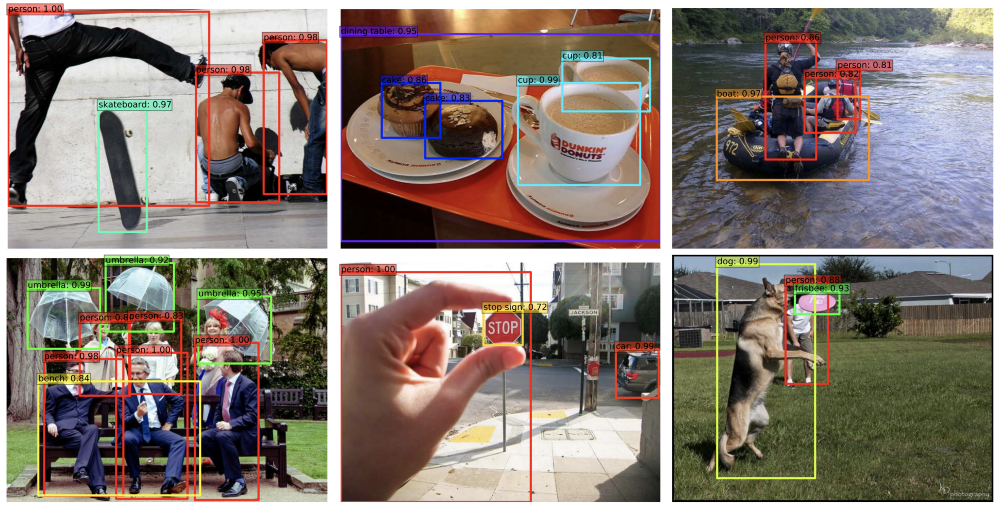
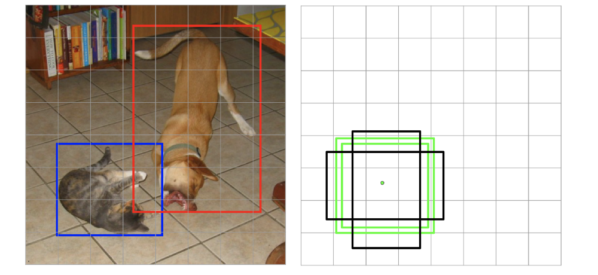
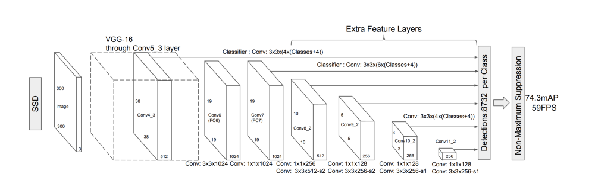

# Open source Deep Neural Network with Opencv

## Python packages
* numpy
* tensorflow_gpu
* OpenCv
* PyQt5
* Matplotlib

## Usage

### MobilenetSdd (Real-time)
`$ python mobilenet.py`

### googlenet image classification (Real-time)

`$ python googlenet.py`

## Mobilenet SSD  (Single-Shot MultiBox Detector)

Object detection refers to the task of identifying various objects within an image and drawing a bounding box around each of them. A few examples are shown below to illustrate this better:

Source: https://arxiv.org/pdf/1512.02325.pdf

A major problem with the first version of YOLO was that its accuracy was very low compared to the state-of-the-art detectors of that time, all of whom operated in two stages: the first stage generated a list of proposals or guesses for where the objects could be within the image and the second stage classified each of the proposed boxes. For more details on how two-stage detectors work, follow this blog post. YOLO belongs to the category of one-stage detectors which remove the proposal generation step and predict the class scores along with the bounding box coordinates directly from the image in an end-to-end framework. Single-Shot Multibox Detector (SSD) was the first one-stage detector to achieve an accuracy reasonably close to the two-stage detectors while still retaining the ability to work in real-time. There have been a lot of efforts towards making one-stage detectors surpass the accuracy of two-stage detectors by tackling several issues with SSD and adding an additional stage of refinement in the one-stage pipeline, but most of them use SSD as the starting point. In his two-part series on real-time object detection, I’ll explain each and every component of SSD in detail and then build upon it in the next part where I discuss several improvements to SSD, including RefineDet, which is the first one-stage detector to achieve state-of-the-art (SOTA) performance.

1. Understanding Default Boxes

The key idea underlying SSD is the concept of default boxes (or anchors). Don’t worry if you have a lot of questions by the end of this section. This section is just meant to give you a high-level picture and a flavour for the things to come.

Default boxes represent carefully selected bounding boxes based on their sizes, aspect ratios and positions across the image. SSD contains 8732 default boxes. The goal of the model is to decide which of the default boxes to use for a given image and then predict offsets from the chosen default boxes to obtain the final prediction. If this sounded like a lot of jargon, stay with me. The following example and the subsequent sections should clear this further. But you need to keep coming back to this point and make sure you are very clear about it. The image below contains objects of two different scales and aspect ratios. We know that as we keep adding convolutional layers, the resolution of the feature map keeps reducing and hence, the receptive field of each cell of the feature map keeps increasing. Thus, earlier layers, having a smaller receptive field are better suited to detect smaller objects whereas later layers, having larger receptive field, can detect larger objects better.
Left: Feature map of resolution 8×8 contains default boxes that match the bounding box corresponding to the cat. Right: Feature map of size 4×4, having larger receptive field, is a better match for the larger bounding box corresponding to the dog.

In the image above, the green (positive) boxes are the default boxes that match at least one ground truth (cat, in case of the left one, and dog, in the right one) whereas the black (negative) default boxes are those that didn’t get matched to any ground truth. Matching here means assigning a label to a default box, positive or negative. I’ll talk about this in more detail later, but the essence here is that certain default boxes are matched to certain bounding boxes in the ground truth while the rest are considered negative. 

### Architecture

The architecture of SSD consists of 3 main components:

* Base network

* Extra feature layers

* Prediction layers

[] (Source: https://arxiv.org/pdf/1512.02325.pdf)
